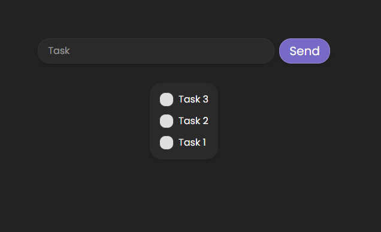

# Todo App

A simple React application "Todo List" built with Vite and Tailwind CSS.



## Features

- Add and remove tasks from the list
- Save with localStorage
- Styled with Tailwind CSS

## Technologies

- [React](https://react.dev/)
- [Vite](https://vitejs.dev/)
- [Tailwind CSS](https://tailwindcss.com/)

## Demo
[View on Github Pages](https://alqw.github.io/react-todo-list/)

## Installation and Setup
```sh
# Clone the repository
git clone https://github.com/alqw/react-todo-list.git

# Navigate to the folder
cd react-todo-list

# Install dependencies
npm install

# Start in development mode
npm run dev
